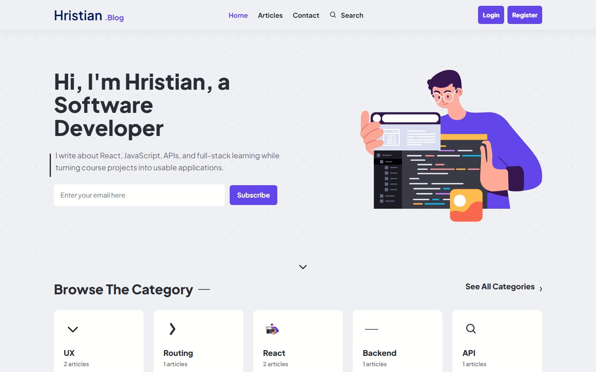
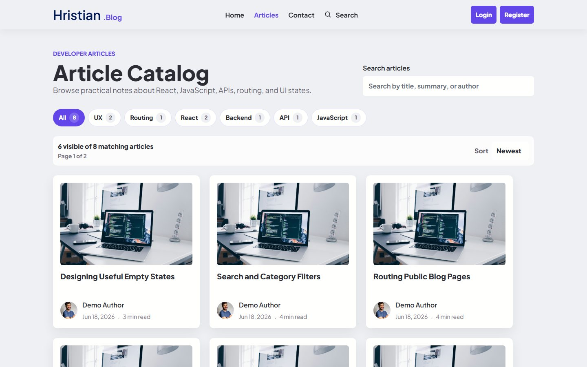
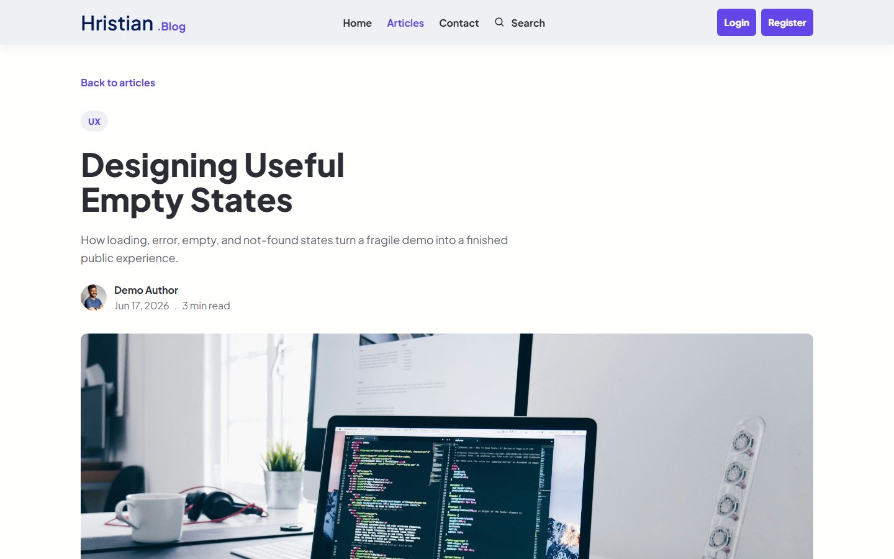
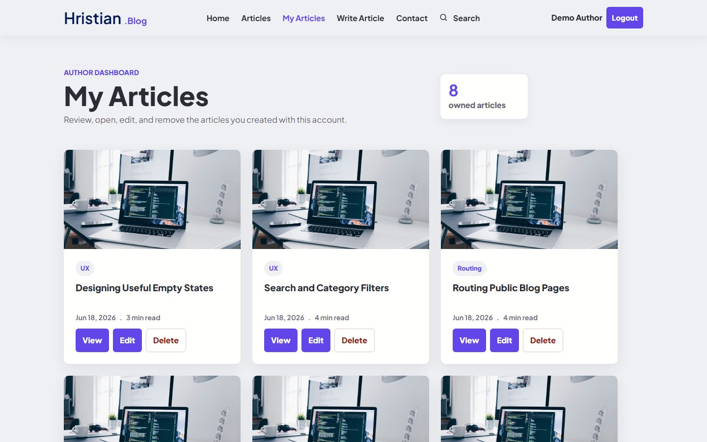
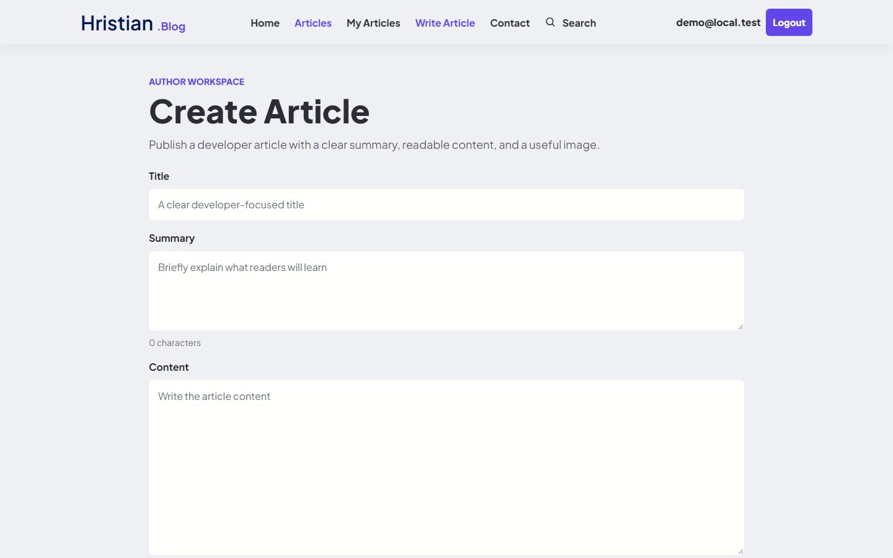
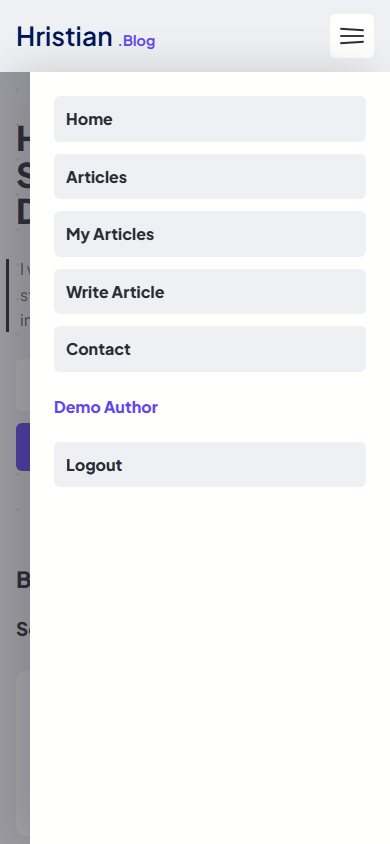

# Hristian Blog

Hristian Blog is a complete local React portfolio demo for writing, browsing, managing, and discussing developer articles against the bundled SoftUni practice server.

[](https://github.com/hristianivanov/SoftUni-ReactJs-project/actions/workflows/ci.yml)



## Engineering Highlights

- Full local CRUD workflow for articles and comments using the SoftUni practice API.
- Protected author workspace with owner-only article and comment controls.
- URL-backed catalog search, category filtering, sorting, and pagination.
- Compact catalog filter chips with stable article-card sizing across pages.
- Lightweight Markdown editor with toolbar, safe live preview, and safe detail rendering.
- Accessible responsive navigation with a focus-managed hamburger drawer.
- Readable authenticated display names while preserving full emails in title attributes.
- Defensive loading, error, empty, not-found, and success states.
- CI-backed lint, unit/component tests, production build, and Playwright browser smoke tests.

## SoftUni Assignment Coverage

- Public pages are available to guests; private article management pages require login.
- 6 dynamic pages cover Home, Article Catalog, Article Details, My Articles, Create Article, and Edit Article.
- Catalog and parameterized details views read articles from the REST API.
- Articles support full CRUD through authenticated create, edit, and delete flows.
- Comments provide the required logged-in user interaction with records.
- Author-only edit/delete controls are enforced in the UI and by the SoftUni practice server.
- Guests can browse basic information but cannot create articles, edit articles, or post comments.
- Private and guest-only route guards cover assignment access rules.
- API communication uses native `fetch` through service modules in `client/src/api`.
- Lint, unit/component tests, Playwright E2E tests, and GitHub Actions verify the main flows.
- Full mapping: [Assignment Compliance](docs/ASSIGNMENT_COMPLIANCE.md).

## Features

- Public home page with featured and recent articles.
- Article catalog with URL-persisted search, category filters, sorting, and 6-item pagination.
- Article detail pages with related articles, comments, and owner-only article actions.
- My Articles dashboard for viewing, editing, and deleting owned articles.
- Markdown article writing workspace with live preview, image preview, and publishing settings.
- Safe Markdown rendering for headings, lists, links, quotes, bold, italic, inline code, and code blocks.
- Registration, login, logout, guest-only auth routes, and persisted local sessions.
- Expired local sessions are cleared and redirected back to login when the practice server rejects a stale token.
- Protected create/edit article routes.
- Authenticated comment creation and owner-only comment deletion.
- Lightweight success feedback for article and comment CRUD actions.
- Responsive desktop navigation and mobile hamburger drawer with backdrop, Escape handling, focus trap, and scroll lock.
- Accessible confirmation dialogs for destructive actions.

## Screenshot Gallery











## Architecture

- `client/src/api` contains service modules for auth, articles, comments, query construction, and requester errors.
- `client/src/auth` owns auth context and local session persistence.
- `client/src/pages` contains route-level screens for public browsing, auth, article editing, details, and My Articles.
- `client/src/components` contains shared UI such as forms, navigation, post cards, status messages, app states, and confirmation dialogs.
- `client/src/utils/articles.js` contains article formatting, filtering, sorting, and pagination helpers.
- `server/data/blog.json` is source material for the local seed script.
- `server/server.js` is the generated SoftUni practice server and is intentionally left unchanged.

## Technology Stack

- React 18, Vite, React Router, JavaScript.
- CSS Modules plus the existing Tailwind base setup.
- React Context for authentication state.
- Native `fetch` wrapped by `client/src/api/requester.js`.
- Vitest, Testing Library, and Playwright for quality checks.
- GitHub Actions for client quality and browser smoke jobs.
- Local SoftUni practice server from the `server` directory.

## Testing

Current local coverage:

- Unit/component tests: 16 files, 57 tests.
- Playwright browser workflows: 11 tests.
- CI jobs: `Client quality` and `Browser smoke`.

Useful commands:

```powershell
npm ci
npm run ci:client
npm --prefix client run test:e2e
npm run capture:screenshots
```

Client-only commands:

```powershell
cd client
npm ci
npm run lint
npm run test:run
npm run build
npm run test:e2e
```

When dependencies change, update and commit the matching `package-lock.json` from the same package directory. Use `npm ci` to reproduce CI installs locally; GitHub Actions runs the client checks on Node 22 with `npm ci --no-audit --no-fund`.

## Local Setup

Install root helper dependencies:

```powershell
npm install
```

Install client dependencies:

```powershell
cd client
npm install
```

Start the API server and Vite client from the repository root:

```powershell
npm run dev
```

The API runs at `http://localhost:3030` and the client runs at `http://localhost:5173`.

The client reads the API URL from `VITE_API_BASE_URL`.

```powershell
Copy-Item client\.env.example client\.env.local
```

Default local value:

```env
VITE_API_BASE_URL=http://localhost:3030
```

With `npm run dev` running, seed local data from a second terminal:

```powershell
npm run seed
```

The seed script is idempotent for an already populated in-memory server.

## Demo Credentials

- Email: `demo@local.test`
- Password: `demo123`

These credentials are for the local practice server only.

## API Endpoints

- `POST /users/register`
- `POST /users/login`
- `GET /users/logout`
- `GET /data/articles`
- `GET /data/articles/:id`
- `POST /data/articles`
- `PUT /data/articles/:id`
- `DELETE /data/articles/:id`
- `GET /data/comments`
- `POST /data/comments`
- `DELETE /data/comments/:id`

## Deployment Status

This repository is not production-deployed. A frontend-only deploy would render the static app, but auth, article writes, comments, and owner checks require a reachable API. See `DEPLOYMENT.md` for deployment blockers and suggested next steps.

## Known Limitations

- No rich-text editor.
- No image upload or media storage.
- No likes, bookmarks, profile editing, password recovery, or admin dashboard.
- Local practice server data is in-memory for each server process and is not a production persistence layer.
- Authentication is educational and stores the local demo session in `localStorage`; restarting the practice server can invalidate stored access tokens, and the app now sends the user back to login when that happens.

## Project Status

Complete local portfolio demo.
